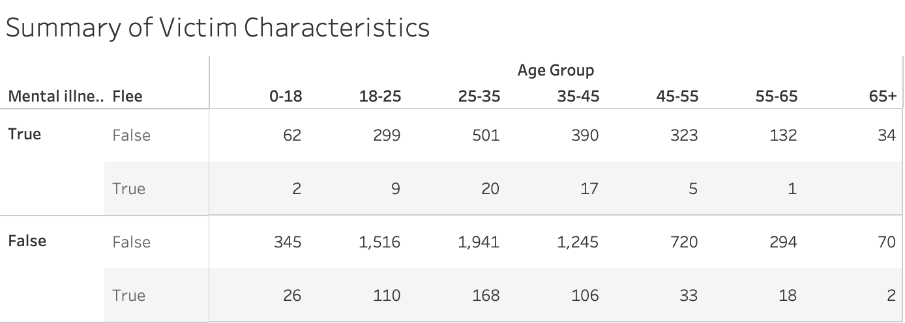
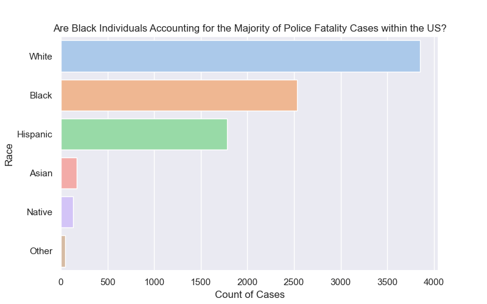
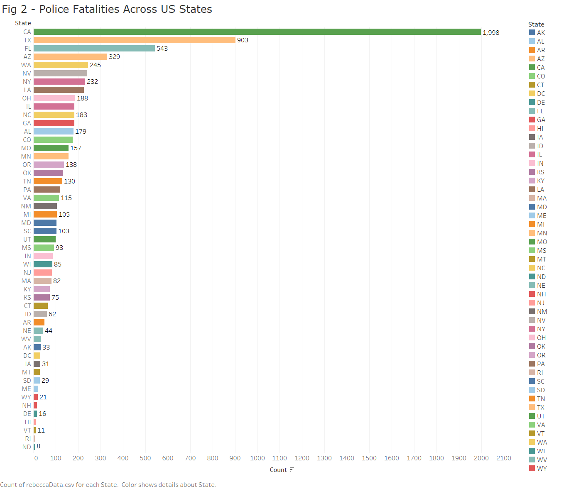
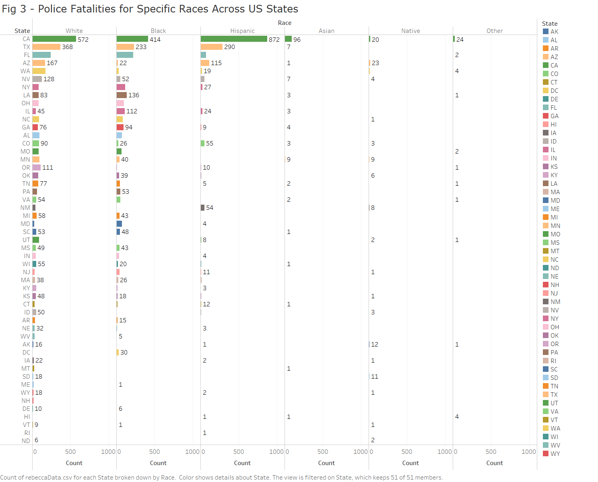
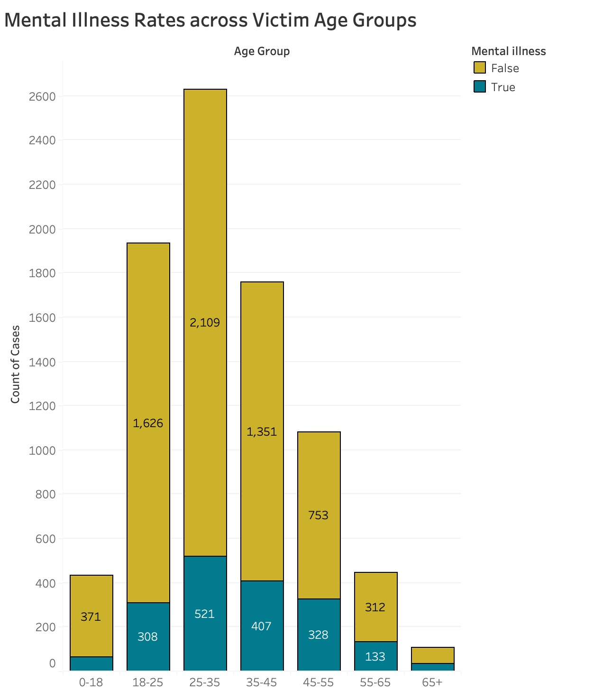
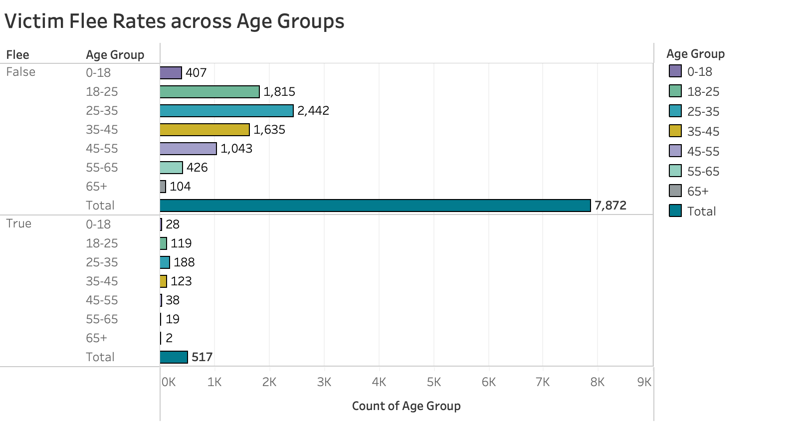
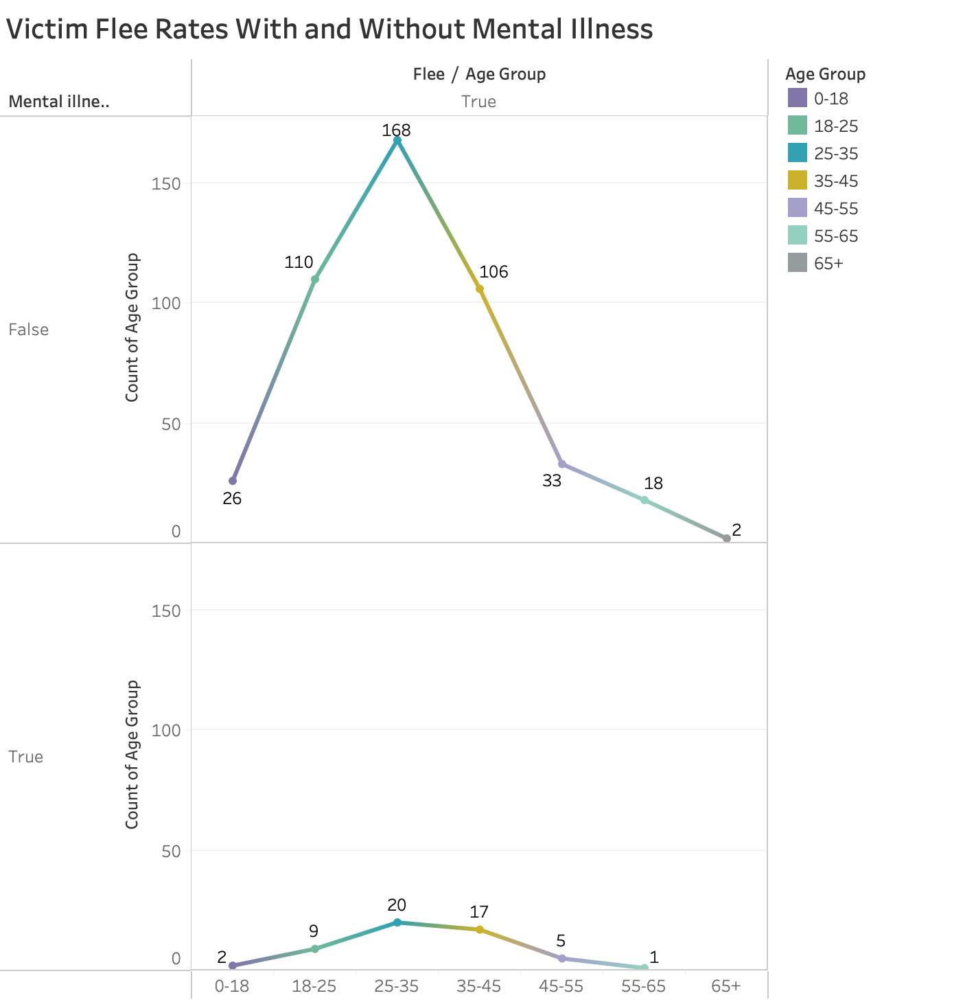

### Introduction

Civilian deaths involving police have increasingly become a topic of interest over recent years. It is important to look with a critical eye to determine if law enforcement carries systemic biases regarding how they interact with civilians. Datasets, including characteristics of the victims killed by police, are an excellent resource for examining who law enforcement has historically been violent with, and highlighting possible insights into why such patterns exist. Improving understanding around police related deaths may help spur new standards of transparency and accountability regarding the behaviour of law enforcement. This project investigated several victim characteristic variables in attempt to determine which conditions were represented in high proportion for those killed during police altercations. Our group has a shared interest in forensic psychology, so naturally this project was a topic we were excited to dig into.

### EDA Highlights

-	Age range initially 1-107 before filtering outliers
-	Greater than 50% increase in mental illness from categories 0-18 (15%) to 65+ (32%)
-	Fleeing was much less common than not fleeing 
-	A sharp decrease in flee occurred across age groups 35-45 to 45-55
-   Only 54 with mental illness fled while 463 without mental illness fled

- White victims accounted for the majority of police fatalities (45.22% of cases), with black individuals accounting for the second highest (29.75% of cases).
-  Asian (2.03%), native (1.52%) and 'other' (0.56%) victims accounted for less than 5% of the total cases of police fatalities.
- California (23.73%) had a disproportionally higher police fatality count compared to other states in the US. With Texas (10.87%) as the second highest police fatality count.
- North Dakota (0.094%) and Rhode island (12%) had the least number of total police fatality cases in the US.
- The only 2 races that had police fatality cases in all states were black and white victims.

**Figure I**

*Note. Summary of victim characteristics, including mental illness and flee rates across age groups.*

### Question 1 & Results (Rebecca)

The following analyses were used as a way to gain insight into the relationship between the race of the victims and the states that police fatalities occur in. I believe that by exploring this relationship, it may show patterns that could reveal whether the views and prejudices potentially held by police officers in each state, could contribute to a specific race being disproportionally impacted by police fatalities. 

Therefore, to investigate this relationship, the following research quesions were used:

**Research Question 1:** Are black individuals accounting for the majority of police fatality cases within the US?

**Research Question 2:** What is the frequency of police fatalities for different states in the US?

**Research Question 3:** Does the number of cases of police fatalities for specific races differ based on different US states on which it occurs in?

***Figure 1***:

*Note: Countplot displaying the race of the victims against the total number of police fatalities. Different colors were used to represent different races and the values represent the specific number of victims for each race.*

**Insight:** Figure 1 provides data to help answer research question 1, 'Are black individuals accounting for the majority of police fatality cases within the US?'. A countplot was chosen as the visualization type due to its ability to effectively visualize categorical data, in this case race against the case count of each race present. Other than this, a countplot is great at making comparisons which is needed for this research question, since the aim is to compare the number of police fatalities of each race.
As seen in this countplot, the highest number of police fatalities involved white victims(45.22% of cases), followed by black(29.75% of cases) and hispanic victims. The 3 lowest counts of police fatalities by race would be asian, native and other. I suspect that the other category could potentially be due to police officers not knowing what the victims' race was.

With the results from this visualization in mind, it leads me to believe that black individuals do not account for the majority of police fatalities within the US, but rather white individuals do. Perhaps a possible reason for this could be that there are other factors, other than race, that influence the occurance of police fatalities such as mental illness.

***Figure 2***:

*Note: Countplot displaying US states against the total number of police fatality cases for each state. The colors are used to distinguish between the different states and the values represent the specific number of police fatality cases for that state.*

**Insight:** Figure 2 provides data to help answer research question 2, 'What is the frequency of police fatalities for different states in the US?'. A countplot was also used for this figure,due to the categorical nature of the data that I wanted to plot (State). Again, I needed to compare the count of cases per state and a countplot would be a clear visualization that would enable me to make comparisons. That said, figure 2 shows that California, Texas, Florida and Arizona have the top 4 highest total counts of police fatatlites. Moreover, Califronia takes on the highest total count of police fataltiies, with its value being almost double of Texas's count of police fatalities (2nd highest state). This became a point of interest, due to reasons revolving around why califronia accounts for a vastly greater amount of police fatatlies compared to other US states. With the exception of the the highest 4 states, all the other states have a relatively lower count with its values slowly decreasing in a steady slope after sorting in ascending order. The 4 states with the lowest counts of police fatatlities were North Dakota, Rhode Island, Hawaii and Vermont. 

These results have led me to conclude that the majority of police fatality cases are in California and that perhaps location could be a factor that is influencing these results. Since, California, Texas, Florida and Arizona are more towards the south of the US, as opposed to North Dakota, Rhode Island and Vermont which are more towards the north.

***Figure 3***:

*Note: Countplot displaying the number of police fatality cases per state for each race.Again, different colors are used to distinguish between the different states and the values represent the specific number of police fatality cases for that race in each specific state.**

**Insight:** Figure 3 was used to help with answering research question 3, 'Does the number of cases of police fatalities for specific races differ based on different US states on which it occurs in?'. A count barchart was used because of its ability to visualize categorical data (State and Race) alongside its case count. This visualization had both race and count on the x-axis, while state was plotted on the y-axis. This is because I wanted to visualize the count of cases per state but seperated specifically by each race. 

That said, figure 3 shows that for white individuals, California, Texas and Florida had the highest number of police fatalities involving white victims, whereas DC and Hawaii had the lowest count of white victims. For black individuals, California, Texas and Florida had the highest number of police fatalities, whereas 6 states (ID,MT,ND,NH,SD and WY) had the lowest count with 0 cases involving black victims. For hispanic individuals, the highest count police fatalities were in California, Texas and Arizona, whereas the lowest counts were in 8 states (AR,DE,ME,MS,ND,SD,VT,and WV) each of them with 0 cases involving hispanic victims.  For asian individuals, the states with the highest police fatalities were California, Minnesota and Texas, whereas there were 0 cases involving asian victims in 24 states such as AK and DE. For native individuals the state with the highest count of police fatalities were Arizona, Califronia and Washington, whereas there was 0 cases in 25 states. For other, the states with the highest police fatalities were in California, Washington and Hawaii, whereas there were 0 other cases in 36 states.

With these results in mind, I can conclude that the number of cases of police fatalities for specific races do differ based on different US states on which it occurs in. It can also be seen that California is consistent in its position as having one of the highest counts of police fatalities for all races and Texas also showed up as being in the top 3 highest counts for 3 races. Additionally, it should also be noted that on average, black and white individuals were more common in terms of being victims of police fatalities. Moreover, this leads me to believe that perhaps these results could be influenced by the population of specific races within specific states in the US, along with what the dominant race within specific states and the specific views they hold about other races. 

### Question 2 & Results (Cameron)

### Question 3 & Results (Zack)

The following analyses were aimed at shedding light on the relationships between the age group of victims, mental illness presence, and flee patterns of those with and without mental illness. To investigate these relationships, I posited the following research questions: 

**RQ 1:** What is the prevalence of mental illness across age groups?

**RQ 2:** Will older individuals flee less often from police than younger individuals?

**RQ 3:** For what age groups is fleeing the police most common for those with/without mental illness?

**Figure 3.1**

*Note. Stacked bar proportions resemble the proportion of those without (top) and with (bottom) mental illness.*

Figure 3.1 helped inform the first research question: What is the prevalence of mental illness across age groups? I used a stacked count plot to display the prevalence of mental illness across the variable “age group”, created from the “filtered age” variable. A stacked count plot is an excellent choice for comparing the occurrences of categorical variables and seeing each condition’s relative proportion to one another. When examining the prevalence of mental illness across the age groups, a pattern appeared. The youngest age group (0-18) had the lowest proportion of mental illness, with 14.71% positive for mental illness. The proportion of mental illness got increasingly larger in the older age groups, despite a negligible decrease across groups 45-55 (30.34% positive for mental illness) to 55-65 (29.89% positive for mental illness). Age groups 18-25 (15.93%), 25-35 (19.81%), 35-45 (23.15%), 65+ (32.10%) followed this increasing pattern. The change in mental illness proportion can be recognized visually through Figure 1. Both groups 0-18 and 55-65 have a similar number of overall cases, yet the blue portion of the bar is significantly larger in the 55-65 group, indicating a larger proportion of victims in the older group had mental illness. As stated in the EDA highlights, the mental illness proportion in the 65+ group is nearly two times larger than in the 0-18 group. A small, positive, simple correlation was found between the presence of mental illness and age (r = .13), indicating the likelihood of a victim being positive for mental illness covaries with increased age. In other words, as age increases, so does the likelihood of having mental illness, by factor ‘r’. 

Considering these results, one may postulate that older individuals have higher rates of mental illness because they have lived for a longer time, providing more opportunities for mental illness to develop. Perhaps those who have run ins with police when they are older have lived a life with increased stressors, such as engaging in illegal activities long term, which could relate to a larger proportion of mental illness.

**Figure 3.2**

*Note. Dual Plot displaying victims who did (top) and did not (bottom) flee from police, across age groups. The total bars sum the count of each condition across age groups.*

Figure 3.2 shed light on the second research question: Will older individuals flee less often from police than younger individuals? I used a side-by-side count plot to visualize the differences, across age groups, of those who fled police and those who did not flee. This plot provides a comparison of the age groups across the two flee conditions, as well as the total number of flee/not flee occurrences. Immediately obvious is the vast difference in the totals of the two flee conditions. Not fleeing police occurred in 7872 of the victim cases, while fleeing occurred in only 517 of victim cases. Not fleeing police was over fifteen times more likely than fleeing. To determine if older victims fled less than younger victims, the proportions of fleeing for each age group must be analysed. For the 65+ group, only 2 victims fled (1.88%). The highest fleeing group was 25-35 (7.15%), followed by 35-45 (7.00%), 0-18 (6.4%), 18-25 (6.15%), 55-65 (4.30%), 45-55 (3.52%), 65+ (1.88%). A sharp decrease in fleeing occurred between groups 35-45 (7.00%) to 45-55 (3.52%). These results confirm that the older age groups have smaller flee proportions than the younger ages. However, this relationship did not appear to be simple and linear, where the highest flee rates exist in the youngest group and the lowest exist in the oldest group, so I did not calculate a simple correlation. The fleeing peak occurred at 25-35 rather than the 0-18 group. These findings suggest there are other variables influencing flee rates other than age. 

It would be informative to investigate other variables which may be exerting influence on this relationship. Victims fleeing police in peaks in middle age, perhaps because the right combination of confidence and agility is present at this age. Younger victims may have the agility to escape police but do not attempt it due to a lack of confidence in their ability to do so successfully. Aging often results in decreased agility, which may explain why the flee rates drop around age 45-55. Victims in the 0-18 age group may not flee police as much because they understand they are minors, which may have implications for legal sentencing. 

**Figure 3.3**

*Note. Dual plot expressing counts of victims across age groups who did flee police, including those without mental illness (top) and those with mental illness (bottom).*

Figure 3.3 helped visualize the third research question: For what age groups is fleeing the police most common for those with/without mental illness? I used a line plot to illustrate the counts of victims who fled police, across mental illness conditions (positive/negative for mental illness). For both mental illness conditions, the age group with the highest flee rate was 25-35(Positive for Mental Illness: 37.04%, Negative for Mental Illness: 36.29%). Older individuals with mental illness fled much less (55-65: 1.85%, 65+: 0%) than older individuals without mental illness (55-65: 3.89%, 65+: .43%). The only two individuals over 65+ who fled were both negative for mental illness. 

Victims without mental illness tended to flee more than victims with mental illness across every age group. One may expect those with mental illness to flee police more commonly due to issues with perception and social functioning. It is apparent that those who fled police and didn't have mental illness do so in a purposeful, deliberate manner. Overall, fleeing with mental illness was quite uncommon in comparison to fleeing without mental illness. It appears fleeing behaviour has a positive relationship with the absence of mental illness (i.e., the absence of mental illness results in an increased chance for fleeing behaviours, in this dataset).

### Summary/Conclusion
