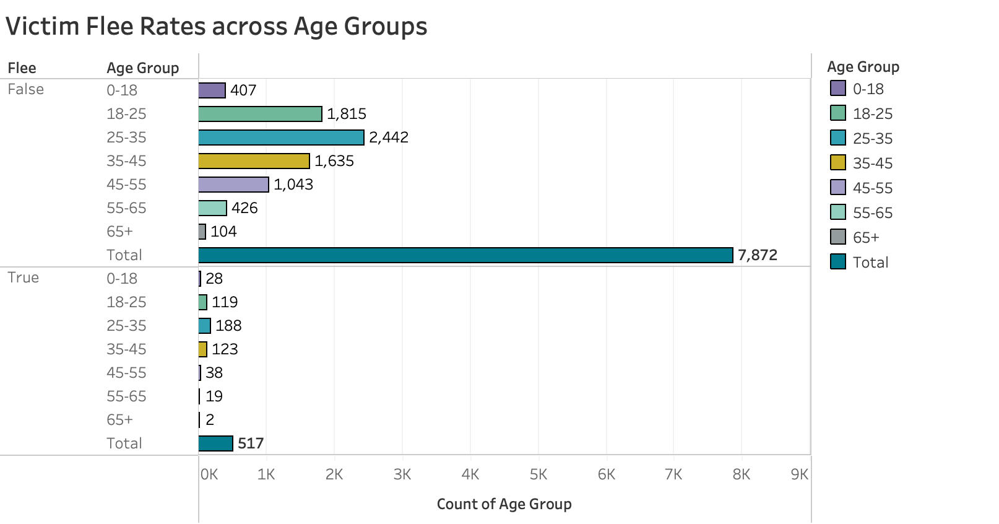
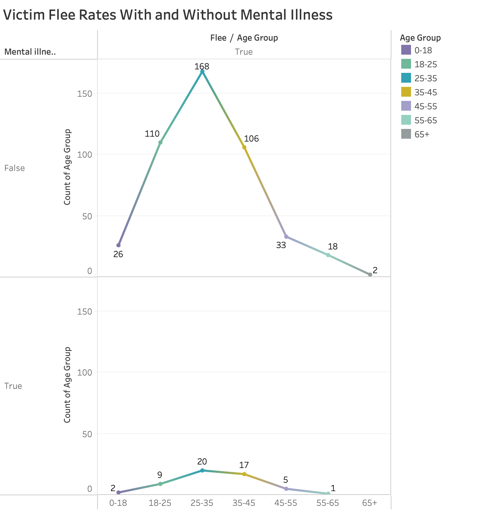

###Introduction

###EDA Highlights

-	Age range initially 1-107 before filtering outliers
-	Greater than 50% increase in mental illness from categories 0-18 (15%) to 65+ (32%)
-	Fleeing was much less common than not fleeing 
-	A sharp decrease in flee occurred across age groups 35-45 to 45-55
-   Only 54 with mental illness fled while 463 without mental illness fled

###Question 1 & Results (Rebecca)

###Question 2 & Results (Cameron)

###Question 3 & Results (Zack)

The following analyses were aimed at shedding light on the relationships between the age group of victims, mental illness presence, and flee patterns of those with and without mental illness. To investigate these relationships, I posited the following research questions: 

**RQ 1:** What is the prevalence of mental illness across age groups?

**RQ 2:** Will older individuals flee less often from police than younger individuals?

**RQ 3:** For what age groups is fleeing the police most common for those with/without mental illness?

**Figure 1**

Figure 1 helped inform the first research question: What is the prevalence of mental illness across age groups? I used a stacked count plot to display the prevalence of mental illness across the variable “age group”, created from the “filtered age” variable. A stacked count plot is an excellent choice for comparing the occurrences of categorical variables and seeing each condition’s relative proportion to one another. When examining the prevalence of mental illness across the age groups, a pattern appeared. The youngest age group (0-18) had the lowest proportion of mental illness, with 14.71% positive for mental illness. The proportion of mental illness got increasingly larger in the older age groups, despite a negligible decrease across groups 45-55 (30.34% positive for mental illness) to 55-65 (29.89% positive for mental illness). Age groups 18-25 (15.93%), 25-35 (19.81%), 35-45 (23.15%), 65+ (32.10%) followed this increasing pattern. The change in mental illness proportion can be recognized visually through Figure 1. Both groups 0-18 and 55-65 have a similar number of overall cases, yet the blue portion of the bar is significantly larger in the 55-65 group, indicating a larger proportion of victims in the older group had mental illness. As stated in the EDA highlights, the mental illness proportion in the 65+ group is nearly two times larger than in the 0-18 group. A small, positive, simple correlation was found between the presence of mental illness and age (r = .13), indicating the likelihood of a victim being positive for mental illness covaries with increased age. In other words, as age increases, so does the likelihood of having mental illness, by factor ‘r’. 

Considering these results, one may postulate that older individuals have higher rates of mental illness because they have lived for a longer time, providing more opportunities for mental illness to develop. Perhaps those who have run ins with police when they are older have lived a life with increased stressors, such as engaging in illegal activities long term, which could relate to a larger proportion of mental illness.

**Figure 2**

Figure 2 shed light on the second research question: Will older individuals flee less often from police than younger individuals? I used a side-by-side count plot to visualize the differences, across age groups, of those who fled police and those who did not flee. This plot provides a comparison of the age groups across the two flee conditions, as well as the total number of flee/not flee occurrences. Immediately obvious is the vast difference in the totals of the two flee conditions. Not fleeing police occurred in 7872 of the victim cases, while fleeing occurred in only 517 of victim cases. Not fleeing police was over fifteen times more likely than fleeing. To determine if older victims fled less than younger victims, the proportions of fleeing for each age group must be analysed. For the 65+ group, only 2 victims fled (1.88%). The highest fleeing group was 25-35 (7.15%), followed by 35-45 (7.00%), 0-18 (6.4%), 18-25 (6.15%), 55-65 (4.30%), 45-55 (3.52%), 65+ (1.88%). A sharp decrease in fleeing occurred between groups 35-45 (7.00%) to 45-55 (3.52%) These results confirm that the older age groups have smaller flee proportions than the younger ages. However, this relationship did not appear to be simple and linear, where the highest flee rates exist in the youngest group and the lowest exist in the oldest group. The fleeing peak occurred at 25-35 rather than the 0-18 group. These findings suggest there are other variables influencing flee rates other than age. 

It would be informative to investigate other variables which may be exerting influence on this relationship. Victims fleeing police in peaks in middle age, perhaps because the right combination of confidence and agility is present at this age. Younger victims may have the agility to escape police but do not attempt it due to a lack of confidence in their ability to do so successfully. Aging often results in decreased agility, which may explain why the flee rates drop around age 45-55. Victims in the 0-18 age group may not flee police as much because they understand they are minors, which may have implications for legal sentencing. 

**Figure 3**

Figure 3 helped visualize the third research question: For what age groups is fleeing the police most common for those with/without mental illness? I used a line plot to illustrate the counts of victims who fled police, across mental illness conditions (positive/negative for mental illness). For both mental illness conditions, the age group with the highest flee rate was 25-35(Positive for Mental Illness: 37.04%, Negative for Mental Illness: 36.29%). Older individuals with mental illness fled much less (55-65: 1.85%, 65+: 0%) than older individuals without mental illness (55-65: 3.89%, 65+: .43%). The only two individuals over 65+ who fled were both negative for mental illness. 

Victims without mental illness tended to flee more than victims with mental illness across every age group. One may expect those with mental illness to flee police more commonly due to issues with perception and social functioning. It is apparent that those who fled police and didn't have mental illness do so in a purposeful, deliberate manner. Overall, fleeing with mental illness was quite uncommon in comparison to fleeing without mental illness. It appears fleeing behaviour has a positive relationship with the absence of mental illness (i.e., the absence of mental illness results in an increased chance for fleeing behaviours, in this dataset).

#Summary/Conclusion

